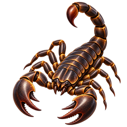
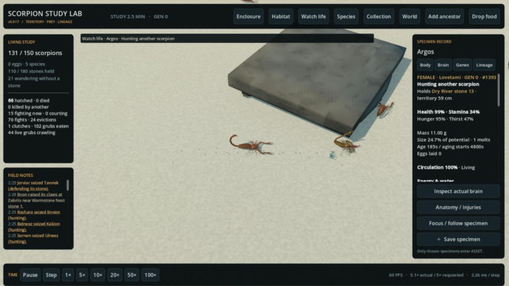
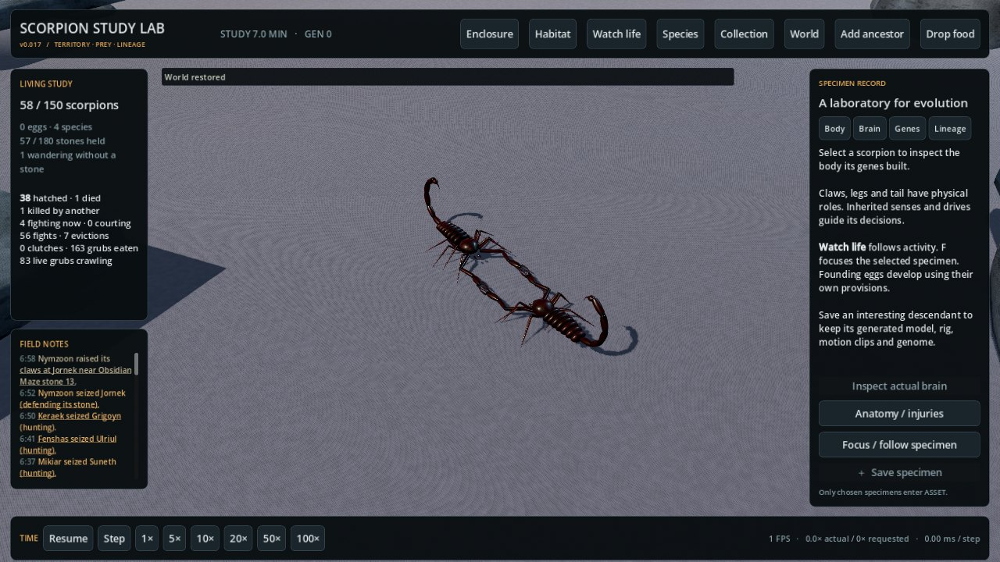
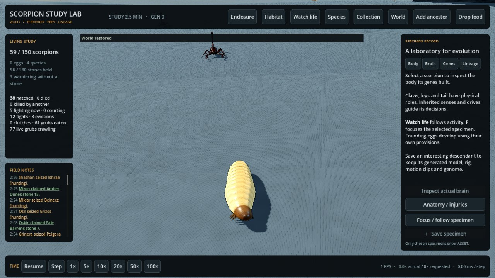

# Scorpion Study Lab

**A living scorpion terrarium you watch rather than control.** Free Windows early build by [Oddsprig](https://oddsprig.com/scorpion-study-lab/).

### [⬇ Download v0.017 for Windows (free, 76 MB)](https://github.com/douglasfpowell2020-a11y/scorpion-study-lab/releases/latest/download/ScorpionStudyLab-v0.017-windows.zip)

Game page: **[oddsprig.com/scorpion-study-lab](https://oddsprig.com/scorpion-study-lab/)** · All releases: [Releases](https://github.com/douglasfpowell2020-a11y/scorpion-study-lab/releases)

150 scorpions, each with its own genes and temperament, claim stones, threaten and fight rivals, hunt live grubs, court, raise broods, molt, grow and die. Every generation inherits from the last.

- **Territory.** 15 stones around a water hole in each habitat. Scorpions hold a stone that fits their body, raise their claws at intruders, fight for ownership and trade up as they grow.
- **Temperament.** No two founders are alike. Bold animals take the good stones; shy ones become wanderers.
- **Living prey.** Grubs crawl, pause, bolt from footsteps and burrow away if they aren't caught.
- **Life history.** Courtship, broods that stay by their mother, molting, aging, cannibalism and death, with a lineage you can trace.
- **Watch life.** An automatic camera finds the most dramatic scene, and field notes tell the colony's story as it happens.

| | |
|---|---|
|  |  |

## How to play

1. Download the ZIP above and extract the whole folder.
2. Run `ScorpionStudyLab.exe`. Keep the `.pck` file and the `data_ScorpionStudyLab_windows_x86_64` folder next to it.
3. If Windows says it protected your PC, choose **More info → Run anyway** (the game is new and not code-signed yet).

Camera: WASD / arrows move, right-drag orbits, left-drag pans, wheel zooms. F follows the selected scorpion, Space pauses, Escape opens study controls. Saves live in `%APPDATA%\ScorpionStudyLab-v0.017`.

Requires Windows 10/11 64-bit and a graphics card with Vulkan support.

## Feedback wanted

This is an early build and we're looking for improvement ideas: what was fun to watch, what felt dull, what broke, and what you'd like to see next.
**[Suggest an improvement or report a bug →](https://github.com/douglasfpowell2020-a11y/scorpion-study-lab/issues/new)**

---
© 2026 [Oddsprig](https://oddsprig.com)
